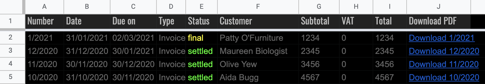

# InvoiceXpress -> Google Sheets connector
Simple connector to list your InvoiceXpress invoices in Google Sheets

This was created a long time ago but since I had to make some changes to adapt to some deprecated API specs, I decided to publish it here on Github.

Note: it now uses the *'new'* API domain and the JSON endpoint (instead of XML).

### Screenshot
  

### To get this working
* Open or create a new Google sheet document
* Go to the menu `Tools` > `Script Editor`
* Overwrite the contents of `Code.gs` (copy&paste)
* Replace the API key and subdomain placeholders with your own
* Save the script
* Go back to the Google sheet document and refresh
* Now you have an `InvoiceXpress` menu option
* Click it and then `Refresh data`

### Automate
* Go back to the Script Editor
* On the left side bar go to `Triggers`
* Add new trigger (Bottom right)
* Adjust trigger settings like this (for example):
  - Function: updateDocuments
  - Deployment: Head
  - Event: Time driven
  - Type: Day timer
  - Time: Midnight to 1am
  
### Other uses
* Create some nice graphs around the data
* Publish the sheet to the web and share it
